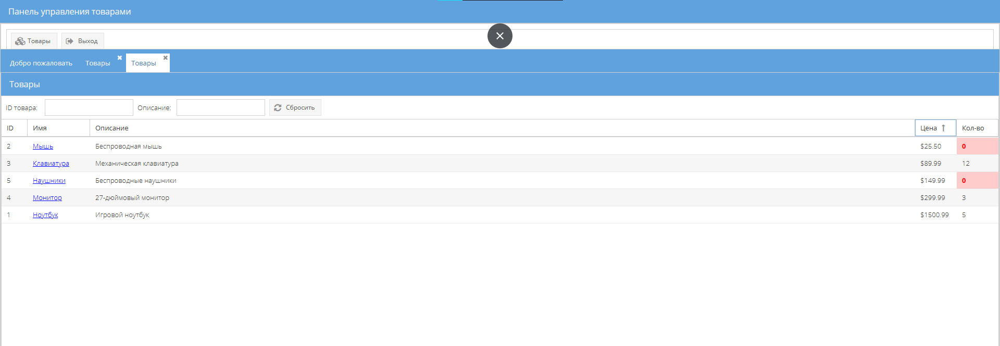

# ExtJS Products Management System

Тестовое задание, cистема управления товарами на основе ExtJS 6.0.0



## 🌟 Особенности

- Аутентификация пользователя
- Таблица товаров с фильтрацией
- Карточка товара с редактированием
- Валидация данных

## 🚀 Быстрый старт

### Способ 1: Live Demo
Откройте https://extjs-products-management.onrender.com

### Способ 2: Локальный запуск
```bash
# Клонировать репозиторий
git clone https://github.com/1exSus/ExtJS_6.git

# Перейти в папку проекта
cd extjs-products-management

# Открыть в браузере index.html

```
P.S.

Вот этот красный текст в описание тестового я не сразу заметил, или его там не было, поэтому без npm и версия 6.0.0 ;)

"По поводу ограничений при скачивании cmd с официального сайта - действительно форма перестала давать скачивать автоматически cmd. Но можно воспользоваться пакетом из npm - https://www.npmjs.com/package/@sencha/cmd
Проверили - работает. При выполнении тестового задания можно пользоваться новой версии sencha - 7.9"

